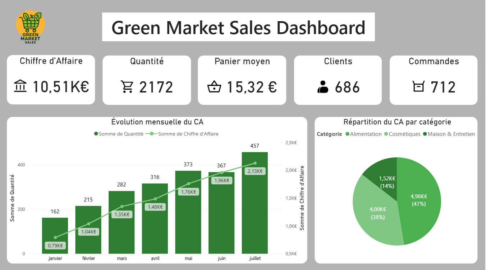
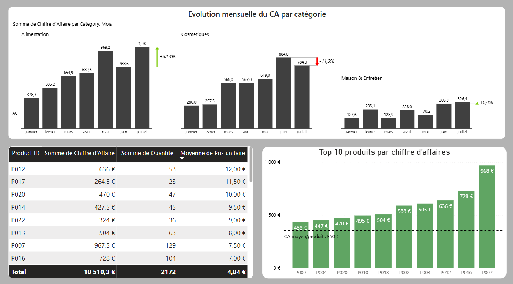

# 🚀 Automatisez vos reportings et transformez vos données en décisions

Vous perdez encore du temps chaque mois à mettre à jour vos fichiers Excel ou vos présentations PowerPoint manuellement ?  
J’aide **les PME, e-commerçants, cabinets de conseil et services financiers** à automatiser leurs reportings avec **Power BI**, **Power Automate** et **Excel avancé (VBA)**.  
Résultat : **gain de temps**, **réduction des erreurs** et **meilleure prise de décision**.

---

## 💼 Ce que je fais pour vous

- **Création de tableaux de bord Power BI** connectés à vos données (Excel, Google Sheets, CSV, SQL, API…).  
- **Automatisation complète** de vos reportings : actualisation planifiée, envoi par email, export automatique PowerPoint ou PDF.  
- **Nettoyage et structuration** des données avec Power Query, SQL ou Python pour des indicateurs fiables.  
- **Mise en place d’alertes automatiques** (CA en baisse, stock faible, dépassement de budget…).  
- **Formations rapides et ciblées** pour rendre vos équipes autonomes sur Power BI et Excel avancé.  

---

## 🎯 Pourquoi travailler avec moi ?

- **Économies immédiates** : réduction du temps passé sur le reporting.  
- **Livraison rapide** : premiers résultats en quelques jours.  
- **Approche simple** : j’automatise à partir de vos fichiers existants, sans complexifier vos process.  

---

## 🛠 Compétences techniques

- **Power BI** : dashboards interactifs, DAX, Power Query, publication web, Power BI Service.  
- **Excel avancé** : macros VBA, automatisation, TCD, modèles dynamiques.  
- **Power Automate** : flux d’actualisation, envoi automatique d’alertes ou rapports.  
- **SQL** : requêtes et intégration dans Power BI.  
- **Python** : traitement de données et automatisations simples.  

---

## 📊 Projets

### 📁 Projet 1 : **TheLook eCommerce** – Dashboard Power BI automatisé (BigQuery)

🔗 [Voir le projet complet ici](https://github.com/AntoineBrousse/TheLook-eCommerce)

**Contexte**  
TheLook eCommerce est un site fictif développé par Google, avec un dataset BigQuery simulant ventes, clients, produits et marketing.  
Objectif : démontrer ma capacité à connecter Power BI à BigQuery, automatiser l’actualisation et fournir des KPI pertinents.

**Fonctionnalités clés**  
- Connexion directe BigQuery → Power BI avec refresh planifié.  
- KPI dynamiques (CA, profit, quantités, panier moyen) avec comparaison N-1.  
- Pages interactives : performance commerciale, analyse produit/marque, performance géographique.  

📷 **Aperçu**  
  
  
  

---

### 📁 Projet 2 : **Green Market** – Automatisation complète avec Power BI + OneDrive + Power Automate

🔗 [Voir le projet complet ici](https://github.com/AntoineBrousse/powerbi-greenmarket)

**Contexte**  
Green Market est une PME fictive vendant des produits alimentaires et éco-responsables.  
Ses ventes mensuelles sont enregistrées dans des fichiers Excel sur OneDrive.  
Avant mon intervention, les équipes devaient importer, nettoyer et mettre à jour manuellement les données chaque mois.

**Solution mise en place**  
- **Connexion Power BI ↔ OneDrive** pour détecter automatiquement les nouveaux fichiers.  
- Nettoyage et formatage des données **directement dans Power Query** (sélection des colonnes utiles, formats unifiés).  
- Workflow **Power Automate** déclenché à chaque ajout de fichier :  
  - Rafraîchissement du dataset Power BI.  
  - Envoi automatique d’un email avec lien vers le rapport actualisé.  

**Valeur ajoutée**  
- Rapport toujours à jour, **sans intervention humaine**.  
- Suppression complète des tâches répétitives.  
- Possibilité d’**ajouter des alertes automatiques** ou **exports PowerPoint** pour les réunions.  

📷 **Aperçu**  
  
  

---

## 🤝 Me contacter

📧 Email : **brousse.antoine14@gmail.com**  
🔗 [LinkedIn](https://www.linkedin.com/in/brousseantoine/)  
